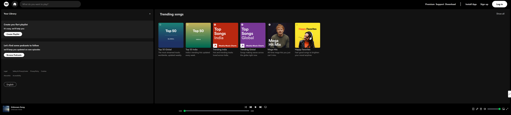
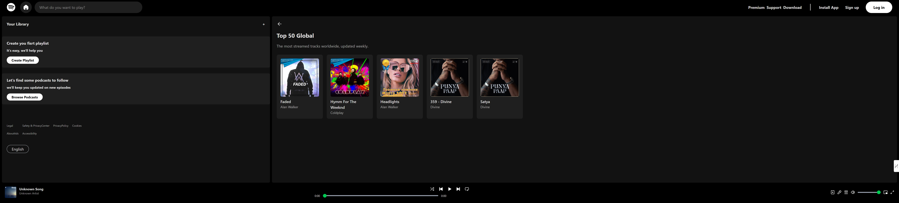

# 🎵 Spotify Clone (React + Vite)

This project is a Spotify-like music streaming UI built using **React** and **Vite**.  
It features a modern layout, responsive design, and dynamic playlist management.

## 🚀 Features
- Built with **React + Vite**
- uses react hooks to manage the music dynamically
- Component-based structure
- Playlist and music player functionality

## 🖼️ Screenshots

### 🎧 Home Page


### 📜 Playlist Page


## ⚙️ Setup Instructions

1. Clone the repository:
   ```bash
   git clone https://github.com/mrinal-daharia/Spotify-clone-react.git
